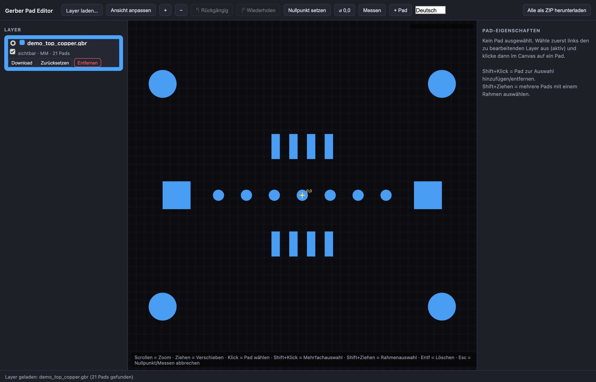
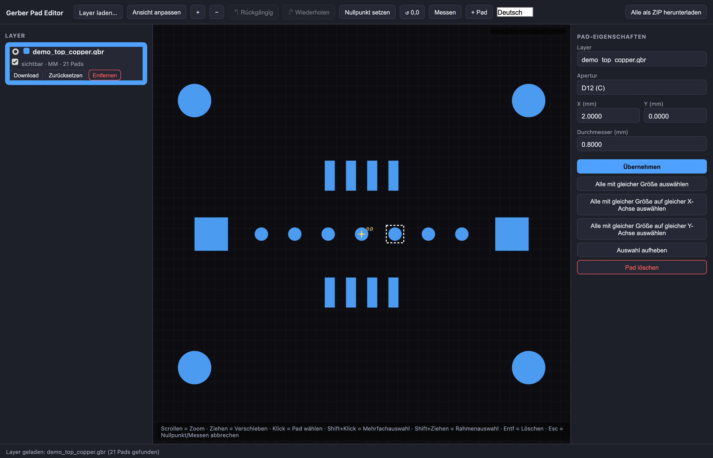
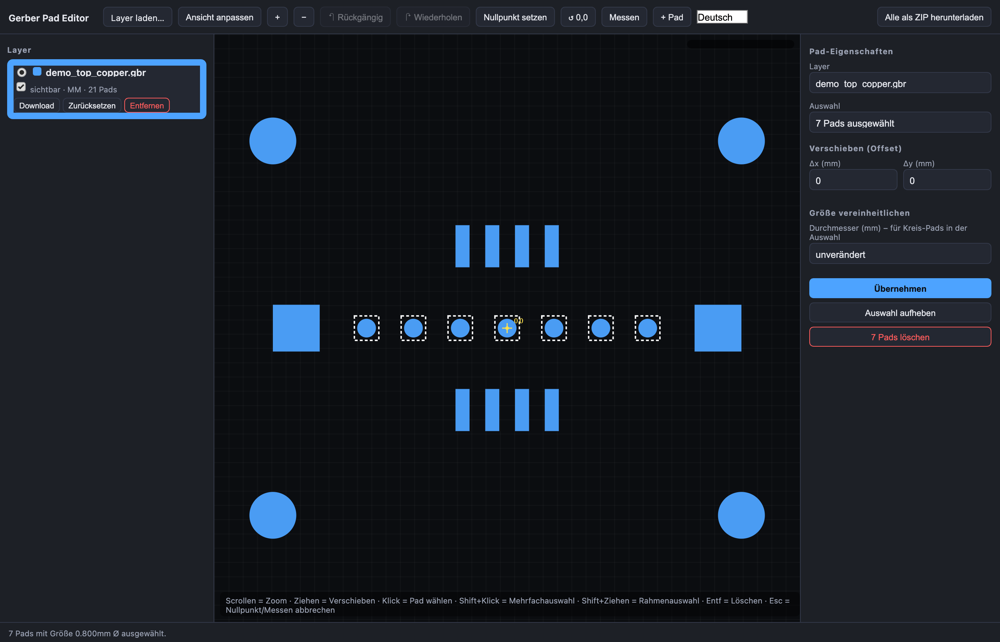
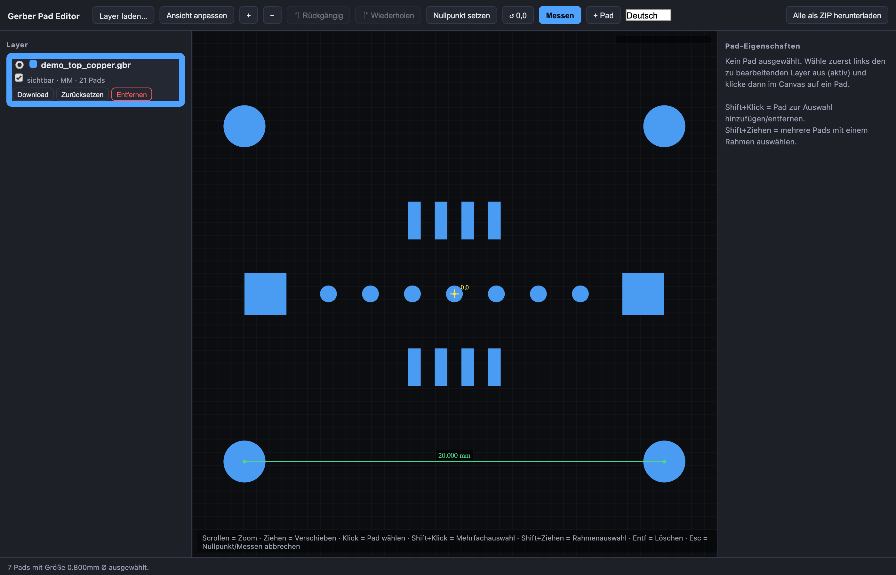
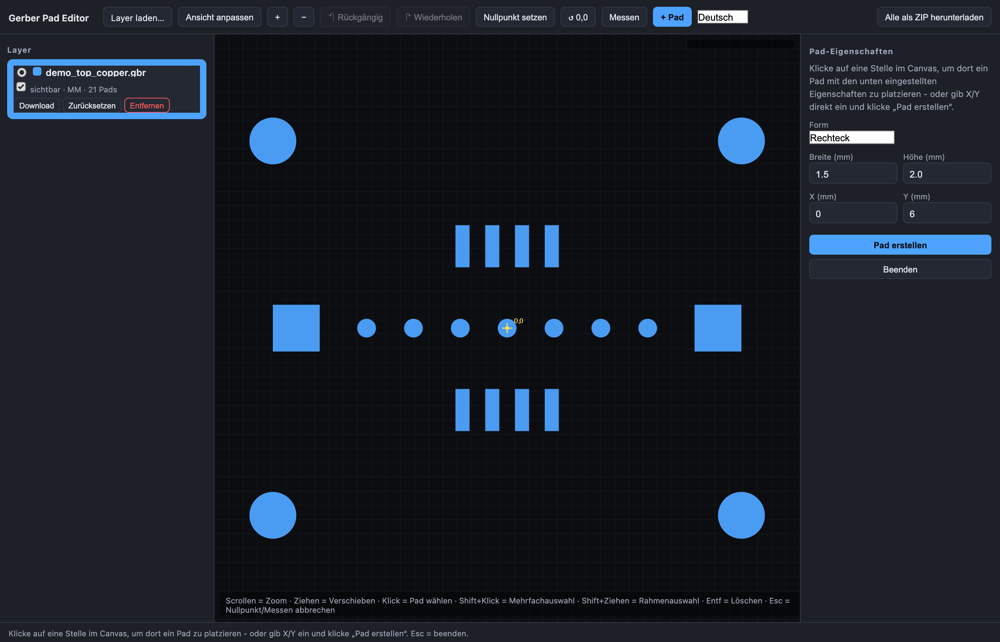
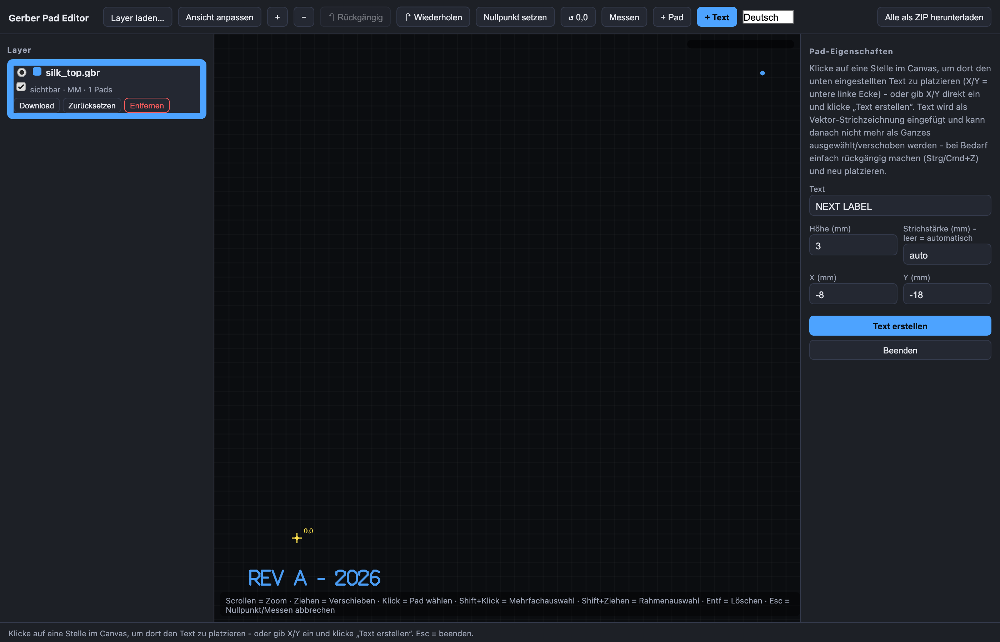
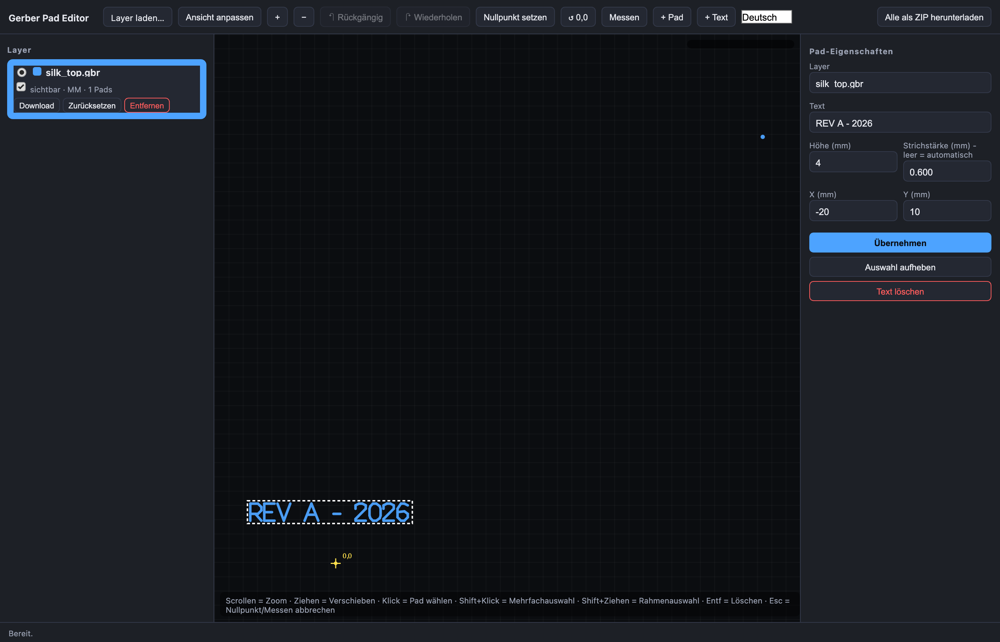
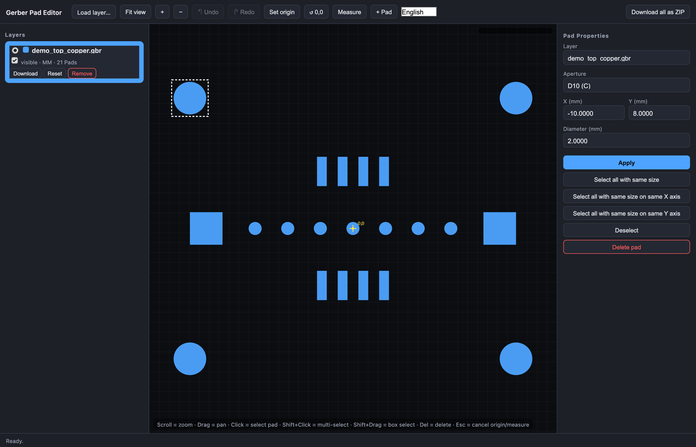

# Gerber Pad Editor

[](https://paypal.me/darkside9009)

A lightweight, browser-based editor for inspecting and editing pads (flashes) in Gerber (RS-274X) PCB layer files — no upload, no install, no build step. Everything runs locally in your browser as plain HTML/CSS/JS.

Load one or more Gerber layers, click on any pad to move it or resize it, batch-edit pads that share the same size, measure distances, set a custom reference origin, draw brand-new pads, and export clean, valid Gerber back out — all through a fast canvas-based UI.



## Features

- **Multi-layer viewer** — load several Gerber files at once, each rendered in its own color, toggle visibility, pick the active (editable) layer.
- **Pad selection & editing** — click a pad to see its layer, aperture, position and size; edit X/Y and diameter/width/height directly (press Enter to apply), or just drag the selected pad on the canvas to reposition it.
- **Lock/unlock** — pads already present in a loaded file start locked against accidental mouse-dragging; select one and click "Unlock" to allow dragging it. Newly drawn pads and text start unlocked (so you can immediately nudge them into place) and can be locked once you're happy with their position. Typing X/Y always works regardless of the lock state — locking only affects mouse-dragging.
- **Batch selection**
  - Select every pad that shares the same size as the current one.
  - Narrow that down further to pads that also share the same **X axis** or **Y axis** position (i.e. the same column or row) — handy for aligned connectors, headers, or via arrays.
  - Shift+click to add/remove pads, Shift+drag for a box (marquee) selection.
- **Multi-pad batch operations** — move a whole selection by a Δx/Δy offset and/or unify the size of every circular and/or rectangular/oval pad in the selection at once, in a single edit.
- **Draw new pads** — pick circle or rectangle, enter diameter or width/height, then either click a spot on the canvas or type exact X/Y coordinates to place it. Reuses an existing aperture definition automatically if one with the same shape/size already exists.
- **Add text** — Gerber has no text primitive, so this generates real vector line-art strokes (exactly like EDA tools do for silkscreen labels) using a built-in stroke font. Type the text, set its height and (optionally) line width, then click a spot on the canvas or type X/Y to place it. Click a placed text again to re-select it and change its content, height, line width or position (either in the form, or by dragging it on the canvas), or delete it — same as editing a pad. (This re-editability is session-only bookkeeping the app keeps on the side; Gerber itself has no concept of "this is one text object", so it's lost on save+reload, same as in any EDA tool's Gerber export.)
- **Custom origin ("Nullpunkt")** — click any point on the canvas to set it as a temporary (0,0) reference; a live HUD shows the mouse position relative to it.
- **Measure tool** — click two points to get the distance (and dx/dy) between them, drawn live on the canvas.
- **Snap grid** — dragging a pad or text on the canvas snaps to a configurable grid (0.1 / 0.25 / 0.5 / 1 mm, picked from the toolbar). Typed X/Y/size values in the forms are never snapped — full precision (0.001 mm steps) always available there.
- **Undo/redo** per layer (Ctrl/Cmd+Z, Ctrl/Cmd+Shift+Z), with a full edit history.
- **Export** — download a single edited layer, or all loaded layers bundled as a ZIP. Output is byte-for-byte valid Gerber, preserving everything the editor didn't touch (comments, macros, other extended commands, legacy `G54`/`G55` D-code prefixes, implicit-coordinate chains, etc.).
- **Bilingual UI** — switch between German and English at any time; your choice is remembered.

## Screenshots

| Pad inspector & same-size selection | Batch-selected pads |
|---|---|
|  |  |

| Measure tool | Draw a new pad |
|---|---|
|  |  |

| Add text (vector stroke font) | Re-select and edit placed text |
|---|---|
|  |  |

| English UI |
|---|
|  |

## Getting started

No build, no dependencies, no server required.

```bash
git clone https://github.com/<your-username>/gerber-pad-editor.git
cd gerber-pad-editor
open index.html   # or just double-click index.html
```

Then click **Load layer…** and pick one or more Gerber files (any extension — the file is validated by parsing it, not by its name).

## Supported Gerber subset

This is a focused pad editor, not a full RS-274X renderer. It understands:

- `%FS…%`, `%MO…%` (format spec, units)
- `%ADD…%` for `C` (circle), `R` (rectangle) and `O` (obround/oval) apertures — these are the shapes you can edit; macro (`%AM…%`) and polygon apertures are rendered and can be moved, but their size isn't editable here
- `%LP…%` polarity, `G36`/`G37` regions, `G01`/`G02`/`G03` draw/arc modes, `D01`/`D02`/`D03` operations
- Legacy `G54`/`G55` aperture-select prefixes and Gerber's "inherit the last X or Y" shorthand

Everything else (other extended commands, comments, unsupported statements) is preserved as opaque passthrough and written back unchanged.

## Project structure

```
index.html    UI layout
style.css     Dark UI theme
gerber.js     Gerber parser, writer and pad-editing primitives (no DOM dependency)
app.js        Application state, canvas rendering, UI wiring, i18n
zip.js        Minimal ZIP writer for the "download all" export
```

## Support

If this tool saved you some time, a tip is always appreciated:

[](https://paypal.me/darkside9009)

## License

MIT — see [LICENSE](LICENSE).
